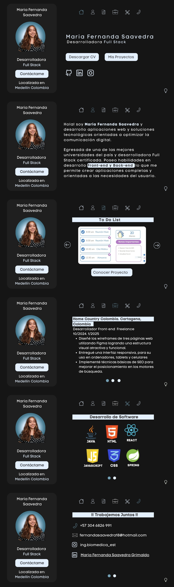
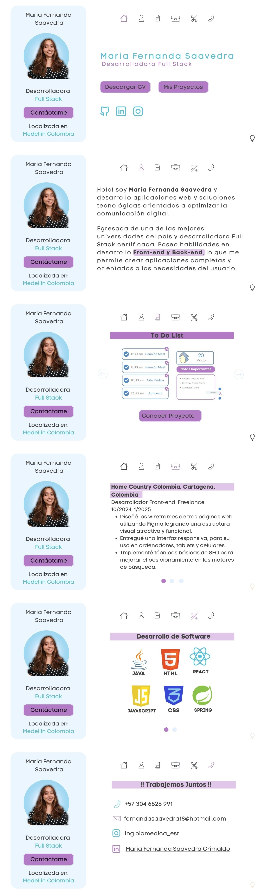

# 📁 Portafolio_2.0

**Portafolio 2.0** es una versión actualizada y optimizada de mi portafolio profesional, donde presento mis habilidades, proyectos y experiencia de una forma más clara, moderna y funcional.

Esta nueva edición refleja no solo mi crecimiento técnico, sino también mi evolución personal y profesional.

---

## 🎨 Diseño

El diseño visual fue realizado en **Canva**, priorizando la simplicidad, accesibilidad y una experiencia de usuario fluida.

### 🖼️ Vistas del diseño

#### 🌙 Modo Oscuro

#### ☀️ Modo Claro

---

## 🌈 Paleta de Colores

- **Color Principal:** `#1E1E2F` (azul oscuro)
- **Color Secundario:** `#F5F5F5` (gris claro)
- **Color de Acento:** `#4E9F3D` (verde)
- **Color de Texto:** `#FFFFFF` en modo oscuro, `#000000` en modo claro

---

## 🔠 Tipografías

- **Título y Encabezados:** *Poppins*
- **Texto del cuerpo:** *Open Sans*
- **Botones y detalles:** *Roboto*

---

## 💡 Tecnologías utilizadas

(Ejemplo: agrega o edita según tu stack real)

- HTML5 / CSS3
- JavaScript
- React
- Git & GitHub

---

## 📫 Contacto

Puedes escribirme a: [fernandasaavedra18@hotmail.com]

---

